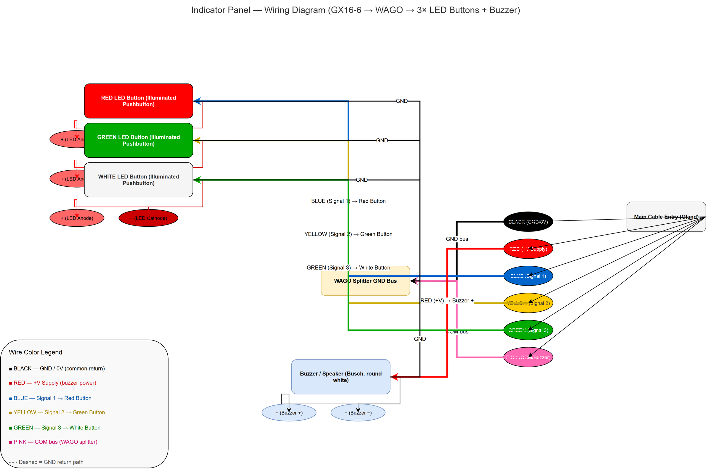

> **All projects made with passion** 💙

Your support helps us continue developing and maintaining these projects. Consider sponsoring!

<iframe src="https://github.com/sponsors/abduznik/card" title="Sponsor abduznik" height="225" width="600" style="border: 0;"></iframe>


> **All projects made with passion** 💙

Your support helps us continue developing and maintaining these projects. Consider sponsoring to help keep them alive!

<iframe src="https://github.com/sponsors/abduznik/card" title="Sponsor abduznik" height="225" width="600" style="border: 0;"></iframe>


# Electrical / KiCad Schematic Skill

A battle-hardened Hermes Agent skill for **generating KiCad 7/8 `.kicad_sch` schematics programmatically from Python**, plus an SVG-based schematic renderer for quick visual output.

Built and proven across **14 revisions** on a real-world Indicator Panel project (GX16-6 → WAGO → 3× LED pushbuttons + buzzer). Every rule, pitfall, and checklist item here was learned the hard way.

---

## One-Shot: The Indicator Panel (Proven Reference)

This skill contains a complete, tested KiCad 8 schematic of a 6-wire indicator panel:



**Components:**
- GX16-6 aviation connector (6-pin, M16 thread)
- WAGO 221-series GND bus bar
- 3× illuminated pushbuttons (RED, GREEN, WHITE) with series resistors
- 1× piezo buzzer/speaker

**Wire color coding:**
| Color | Signal | Destination |
|-------|--------|-------------|
| Black | GND return | WAGO GND bus → loads |
| Red | +V supply | Buzzer positive |
| Blue | Signal 1 | Red button LED+ |
| Yellow | Signal 2 | Green button LED+ |
| Green | Signal 3 | White button LED+ |
| Pink | COM bus | WAGO splitter → GND |

The final `.kicad_sch` file is included in this repo as `indicator_panel.kicad_sch`.

---

## What's In This Repo

| File | Purpose |
|------|---------|
| `SKILL.md` | Full Hermes skill — 4,632 words of KiCad generation rules, routing patterns, inline symbol definitions, power symbol placement, and battle-tested pitfalls |
| `kicad_linter.py` | AI-grade self-check linter for `.kicad_sch` files — catches grid violations, missing junctions, color crossings, missing inline symbol definitions, GND_PWR count/clearance, and duplicate definitions |
| `gen_v6.py` | Complete self-validating schematic generator for the Indicator Panel — class-based, runs linter automatically, produces production-ready `.kicad_sch` files |
| `indicator_panel.kicad_sch` | Final Rev 14.1 schematic — opens directly in KiCad 8, all symbols inline (no library dependencies) |
| `indicator_panel.kicad_pro` | KiCad 8 project file (pair with the `.kicad_sch`) |
| `references/` | 4 reference files covering S-expression format, color-swap patterns, single GND placement, and routing patterns |
| `renderer.py` | Legacy SVG-based schematic renderer (original skill code — generates component diagrams as SVG) |
| `symbols.py` | SVG component primitives for the renderer |
| `generate_examples.py` | Demo circuits for the SVG renderer |

---

## The Linter (`kicad_linter.py`)

This is the most important tool. Run it BEFORE delivering any `.kicad_sch` file:

```bash
python3 kicad_linter.py indicator_panel.kicad_sch
```

**Checks performed (v2.0):**
- **GRID** — off-grid coordinates
- **SHORT** — wires shorter than 25 mil
- **DIAGONAL** — non-orthogonal wires
- **OVERLAP** — component body overlap
- **LABEL** — overlapping text labels
- **TJUNCTION** — missing junction dots at T-intersections
- **COLOR-CROSS** — different-net wire endpoint overlap (catches accidental shorts)
- **ROWS** — component row spacing < 300 mil
- **SYMBOL** — every `lib_id` reference has a matching inline definition in `lib_symbols` (catches the "R_US not found" error)
- **GND_PWR** — warns if more than 1 GND_PWR instance (user prefers single GND on trunk)
- **GND_CLR** — checks minimum 10mm clearance from GND_PWR to component bodies
- **DUPLICATE** — warns about duplicate symbol definitions

---

## The Generator Pattern (`gen_v6.py`)

The indicator panel generator demonstrates the project pattern:

1. **Constants** — component positions, dimensions, body sizes
2. **S-expression builder** — `symbol_instance()`, `power_instance()`, `wire()`, `label()`, `junc()` emit methods
3. **Inline symbol definitions** — all symbols defined in `lib_symbols` (no external library dependencies)
4. **Self-audit** — component position table with clearance checks
5. **Auto-lint** — runs `kicad_linter.py` after every build, aborts on violation
6. **Pre-delivery checklist** — answers 5 explicit confirmation questions

---

## Critical Rules (Learned the Hard Way)

### 1. Surgical Changes Only
When the user says "swap the colors," change ONLY the `net_color_key` value. Do NOT touch pin names, routing, GND symbols, or anything else. Every unsolicited "also fix" cost a full revision cycle.

### 2. Generator Must Know All Manual Edits
If you manually edit the `.kicad_sch` file (e.g., move a component), update the generator constants BEFORE regenerating. Regenerating from a stale generator silently destroys manual edits.

### 3. Single GND on the Trunk
When GND wires interconnect through a common bus, ONE GND_PWR symbol is sufficient. Place it ≥10mm from the nearest component body. Per-component GND symbols create visual clutter and were explicitly rejected.

### 4. GND_PWR Triangle Direction
```sexpr
(polyline (pts (xy 0 0) (xy -3.81 3.81) (xy 3.81 3.81) (xy 0 0))
```
Tip at connection (Y=0), flat bar below (Y=3.81). Do NOT substitute with flat-bar-at-top — the user called that "upside down."

### 5. Inline Symbols for Portability
All symbols must be defined in `lib_symbols` with no external library references. KiCad shows "?" for unresolved library symbols. The `Device:R_US` reference was rejected and replaced with a continuous polyline inline symbol.

### 6. Pre-Delivery Checklist
Before sending any file:
1. ✅ GND_PWR triangle direction — user-approved variant?
2. ✅ GND_PWR count — exactly 1 instance?
3. ✅ Wire colors match physical cable, not pin names?
4. ✅ Signal flow — each pin routes to correct destination?
5. ✅ Component clearance — all OK? Minimum gap ≥ 5mm?
6. ✅ Generator sync — does `gen_v6.py` produce ALL elements?
7. ✅ Revision bump — both generator and schematic?
8. ✅ Linter passes — PASS: No violations found.
9. ✅ User opens in KiCad — confirm no parser errors.
10. ✅ No scope creep — did you ONLY change what was asked?

---

## Common Pitfalls

| Pitfall | Cost | How to Avoid |
|---------|------|-------------|
| Over-engineering a color swap | 3 revisions | Change only the `net_color_key`. Nothing else. |
| Stale generator (TB1_Y mismatch) | 2 revisions | Diff before regenerating. Update constants first. |
| GND_PWR triangle direction | 3 revisions | Always use the tip-at-connection variant. |
| Per-component GND symbols | 2 revisions | One GND on the trunk. User preference. |
| Missing inline R_US definition | 2 revisions | Run SYMBOL linter check before delivery. |
| Double R_US definition | Accepted | KiCad uses the last definition, but it wastes bytes. |
| "Also fixing" unrelated things | Every time | Stop. Deliver the minimal change. Offer other fixes separately. |

---

## Quick Start

```bash
# Lint a schematic
python3 kicad_linter.py my_schematic.kicad_sch

# Generate the indicator panel (modify and reuse)
python3 gen_v6.py

# Read the full skill (all rules, patterns, and pitfalls)
# SKILL.md
```

---

## License

MIT — use freely, learn from the mistakes documented here, and don't charge $1.50 in token costs for a schematic.